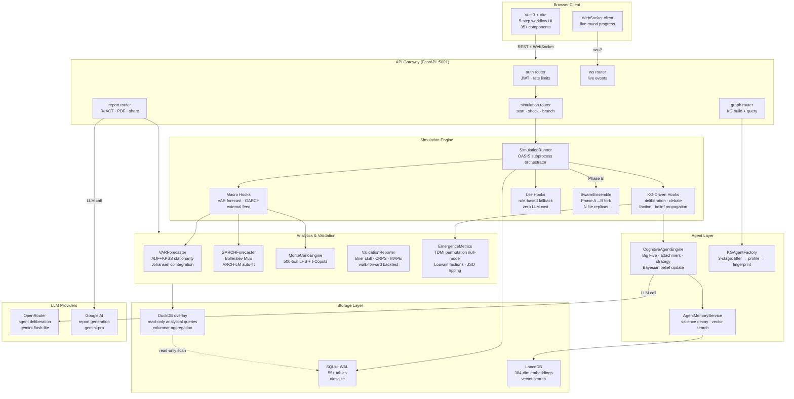

# 👁️ MurmuraScope
### Predict the Social Pulse | 預見社會脈動 | 預見社會脈動


---

## 🌟 Overview / 概覽 / 概览

**[EN]** MurmuraScope is a universal prediction engine that transforms any text into a high-fidelity social simulation. By dropping in news, articles, or reports, it automatically creates digital "agents" that interact, debate, and evolve, providing you with data-driven forecasts on social outcomes.

**[繁中]** MurmuraScope 是一個通用的預測引擎，能將任何文本轉化為高真度的社會模擬。只需放入新聞、文章或報告，系統就會自動創建數位「智能代理」進行互動、辯論與演化，為您提供基於數據的社會發展預測。

**[简中]** MurmuraScope 是一个通用的预测引擎，能将任何文本转化为高真度的社会模拟。只需放入新闻、文章或报告，系统就会自动创建数字“智能代理”进行互动、辩论与演化，为您提供基于数据的社会发展预测。

---

## 🎯 Use Cases: When to use MurmuraScope?
### 應用場景：MurmuraScope 能為你解決什麼？ | 应用场景：MurmuraScope 能为你解决什么？

| Scenario / 場景 / 场景 | How it helps / 運作方式 / 运作方式 |
| :--- | :--- |
| **Breaking News Reaction** <br> 突發新聞反應分析 | Predict how different social factions (e.g., conservatives vs. progressives) will react to a new policy or event. <br> 預測不同社會群體（如：保守派 vs 進取派）對新政策或事件的反應。 |
| **Geopolitical Analysis** <br> 地緣政治分析 | Simulate potential escalations or diplomatic shifts based on recent strategic briefs. <br> 根據最新的戰略簡報，模擬潛在的局勢升級或外交轉向。 |
| **Market Sentiment** <br> 市場情緒預測 | Understand how a new product launch or economic shift ripples through a community’s belief system. <br> 了解新產品發佈或經濟變動如何影響社群的信念體系。 |
| **Crisis Management** <br> 危機管理模擬 | Test different "what-if" scenarios (Shocks) to see which intervention effectively calms social unrest. <br> 測試不同的「如果」場景（衝擊），觀察哪種干預措施能有效平息社會動盪。 |

---

## ✨ Key Features / 核心功能 / 核心功能

*   **🧠 Instant Intelligence (無須設定，即時生成):** No manual agent creation. The engine extracts personalities (Big Five traits) and beliefs directly from your text.
*   **📊 Probabilistic Forecasting (數據化預測):** Runs hundreds of "Monte Carlo" trials to give you clear confidence intervals and likelihoods.
*   **🗣️ Interactive Interviews (互動式採訪):** Don't just watch—talk to the agents. "Interview" digital characters to understand their logic.
*   **⚡ Branching Realities (多重現實分支):** At any point, inject a "Shock" (e.g., a sudden rumor or a disaster) to see how it alters the future.

---

## 🚀 The 5-Step Workflow / 五步流程 / 五步流程

1.  **Input (輸入):** Paste your source text.
2.  **Extract (提取):** System builds a Knowledge Graph of people and organizations.
3.  **Generate (生成):** Up to 500+ unique agents appear with distinct psychological profiles.
4.  **Simulate (模擬):** Watch rounds of debates, faction forming, and belief updates.
5.  **Report (報告):** Receive a comprehensive AI-generated report with statistical charts.

---

## 🛠 Quickstart / 快速入門 / 快速入门

```bash
cp .env.example .env        # add OPENROUTER_API_KEY + GOOGLE_API_KEY
docker compose up -d        # frontend :8080 · backend :5001
```

Or locally:
```bash
cd backend && uvicorn run:app --reload --port 5001
cd frontend && npm run dev   # :5173
```

---

## 🔬 Technical Deep Dive / 技術深挖 / 技术深挖

<details>
<summary><b>📊 System Architecture (系統架構圖)</b></summary>


</details>

<details>
<summary><b>🎮 Simulation Modes & Presets (模擬模式與預設)</b></summary>

| Mode | Trigger | Agent source | Decision space |
|------|---------|-------------|---------------|
| `kg_driven` | Any non-HK seed | KGAgentFactory (LLM-generated) | ScenarioGenerator (LLM) |
| `hk_demographic` | HK keywords in seed | HK Census AgentFactory | Hardcoded DecisionType enum |

| Preset | Agents | Rounds | Emergence |
|--------|--------|--------|-----------|
| FAST | 100 | 15 | Off |
| STANDARD | 300 | 20 | On |
| DEEP | 500 | 30 | On |
| LARGE | 1,000 | 25 | On |
| custom | up to 50,000 | up to 100 | On |
</details>

<details>
<summary><b>🏗️ Backend Structure (後端結構)</b></summary>

```
backend/
├── app/
│   ├── api/                  FastAPI routers (18 modules)
│   ├── services/             50+ business logic services
│   │   ├── simulation_runner.py          OASIS subprocess orchestrator
│   │   ├── cognitive_agent_engine.py     LLM deliberation + risk appetite
│   │   ├── belief_system.py              Bayesian update
│   │   ├── var_forecaster.py             VAR / VECM + stationarity
│   │   ├── garch_model.py                GARCH(1,1) volatility
│   │   └── validation_reporter.py        composite score A–F
│   ├── models/               Pydantic (frozen) + frozen dataclasses
│   └── utils/
│       ├── db.py             aiosqlite connection (WAL + FK enforcement)
│       └── llm_client.py     provider-agnostic LLM client + cost tracker
├── database/schema.sql       55+ table schema (source of truth)
└── tests/                    2700+ unit + 134 integration tests
```
</details>

<details>
<summary><b>📈 Statistical & Econometric Layer (統計與計量經濟層)</b></summary>

| Feature | Implementation |
|---------|---------------|
| Stationarity | ADF + KPSS dual test before every VAR fit |
| VAR / VECM | Johansen cointegration test; VECM when cointegrated |
| GARCH(1,1) | Bollerslev (1986) MLE via scipy |
| Monte Carlo | 500-trial LHS + t-Copula |
| TDMI | Kraskov KNN estimator; permutation null-model |
| Backtesting | Walk-forward k-fold |
</details>

<details>
<summary><b>🔑 Key Commands (關鍵指令)</b></summary>

```bash
make test           # unit tests (~2700 tests, ~20s)
make test-int       # integration tests
make test-cov       # coverage report → htmlcov/
make stop           # kill all simulation processes
make docker-logs    # follow container logs
```
</details>

<details>
<summary><b>⚙️ Environment Variables (環境變數)</b></summary>

```env
# Required
OPENROUTER_API_KEY=             # agent LLM calls
GOOGLE_API_KEY=                 # report generation
AUTH_SECRET_KEY=                # JWT signing key
SESSION_ENCRYPTION_KEY=         # BYOK key encryption

# LLM models
AGENT_LLM_MODEL=google/gemini-3.1-flash-lite-preview
GOOGLE_REPORT_MODEL=gemini-3.1-pro-preview

# Cost controls
SESSION_COST_BUDGET_USD=5       # warning threshold
SESSION_COST_HARD_CAP_USD=10    # hard pause
```
</details>

---

## 📜 License / 許可證 / 许可证

Proprietary. All rights reserved. / 私有軟體，保留所有權利。 / 私有软件，保留所有权利。
