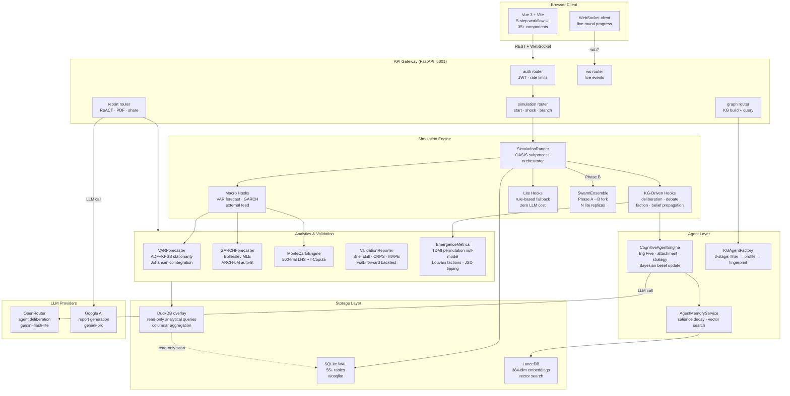

# MurmuraScope

A universal prediction engine that turns any text into a runnable social simulation.

Drop in a news article, novel excerpt, or geopolitical brief — the engine automatically extracts actors, generates agents with distinct personalities and beliefs, runs the simulation, and outputs probabilistic forecasts with confidence intervals.

---

## How it works — 5 steps

**Step 1 — Paste text.** The engine reads seed text, extracts entities and relationships into a knowledge graph, and generates up to 50 implied actors you didn't mention explicitly.

**Step 2 — Agents appear.** Each agent gets Big Five personality traits, a three-dimensional emotional state, a Bayesian belief system, and a cognitive fingerprint. No manual configuration.

**Step 3 — Simulation runs.** Agents interact across rounds: debate, form factions, update beliefs, propagate information. LLM deliberation for key stakeholders; rule-based lite hooks for background agents (cost-efficient).

**Step 4 — Forecasts with numbers.** Monte Carlo ensemble (up to 500 trials), AutoARIMA + VAR time-series models, stationarity-checked before fitting, GARCH(1,1) for volatility during crises. Walk-forward backtesting with CRPS, Brier skill, MAPE, Pearson r.

**Step 5 — Explore.** Interview any agent in character. Branch the simulation at any tipping point. Inject shocks. Compare counterfactuals.

---

## Quickstart

```bash
cp .env.example .env        # add OPENROUTER_API_KEY + GOOGLE_API_KEY
docker compose up -d        # frontend :8080 · backend :5001
```

Or locally:
```bash
cd backend && uvicorn run:app --reload --port 5001
cd frontend && npm run dev   # :5173
```

---

## Key commands

```bash
make test           # unit tests (~2700 tests, ~20s)
make test-int       # integration tests
make test-cov       # coverage report → htmlcov/
make test-changed   # only tests for files you changed
make stop           # kill all simulation processes
make docker-logs    # follow container logs
```

---

## System Architecture



---

## Simulation modes

| Mode | Trigger | Agent source | Decision space |
|------|---------|-------------|---------------|
| `kg_driven` | Any non-HK seed | KGAgentFactory (LLM-generated) | ScenarioGenerator (LLM) |
| `hk_demographic` | HK keywords in seed | HK Census AgentFactory | Hardcoded DecisionType enum |

## Simulation presets

| Preset | Agents | Rounds | Emergence |
|--------|--------|--------|-----------|
| FAST | 100 | 15 | Off |
| STANDARD | 300 | 20 | On |
| DEEP | 500 | 30 | On |
| LARGE | 1,000 | 25 | On |
| custom | up to 50,000 | up to 100 | On |

---

## Backend structure

```
backend/
├── app/
│   ├── api/                  FastAPI routers (18 modules)
│   │   ├── auth.py           JWT auth · rate limits
│   │   ├── simulation.py     start · shock · branch · swarm
│   │   ├── graph.py          KG build + temporal query
│   │   ├── report.py         ReACT report · PDF · share
│   │   └── ws.py             WebSocket live progress
│   ├── services/             50+ business logic services
│   │   ├── simulation_runner.py          OASIS subprocess orchestrator
│   │   ├── simulation_hooks_kg_driven.py KG-driven round hooks
│   │   ├── simulation_hooks_macro.py     macro feedback + external feed
│   │   ├── simulation_lifecycle.py       run / stop / cleanup
│   │   ├── lite_hooks.py                 rule-based LLM fallbacks
│   │   ├── cognitive_agent_engine.py     LLM deliberation + risk appetite
│   │   ├── belief_system.py              Bayesian update
│   │   ├── var_forecaster.py             VAR / VECM + stationarity
│   │   ├── garch_model.py                GARCH(1,1) volatility
│   │   ├── emergence_metrics.py          TDMI + Louvain factions
│   │   ├── validation_reporter.py        composite score A–F
│   │   └── swarm_ensemble.py             probability cloud pipeline
│   ├── models/               Pydantic (frozen) + frozen dataclasses
│   ├── utils/
│   │   ├── db.py             aiosqlite connection (WAL + FK enforcement)
│   │   ├── duckdb_analytics.py  read-only analytical overlay
│   │   ├── llm_client.py     provider-agnostic LLM client + cost tracker
│   │   └── prompt_security.py   injection sanitisation
│   └── domain/               7 built-in domain packs
├── database/schema.sql       55+ table schema (source of truth)
├── prompts/                  LLM prompt templates
├── scripts/                  OASIS subprocess runner
└── tests/                    2700+ unit + 134 integration tests
```

---

## Simulation hook groups (per round)

```
Pre-Group-1:  feed ranking | world event generation (kg_driven)
Group 1 (parallel):
  memories · trust · emotional state · relationship states
Group 2 (sequential):
  decisions → side effects → belief update → consumption
  kg_driven: strategic planning → LLM deliberation (all active agents)
             → consensus debate (every 3rd round) → belief propagation
Group 3 (periodic, fire-and-forget):
  echo chambers(3) · network evolution(3) · virality(3)
  macro feedback(5) · KG evolution(3) · polarization(5) · TDMI(5)
  kg_driven: faction + tipping(3) · relationship lifecycle(3)
```

---

## Statistical / econometric layer

| Feature | Implementation |
|---------|---------------|
| Stationarity | ADF + KPSS dual test before every VAR fit; auto-differencing if I(1)/I(2) |
| VAR / VECM | Johansen cointegration test; VECM when cointegrated, VAR otherwise |
| GARCH(1,1) | Bollerslev (1986) MLE via scipy; auto-fits when ARCH LM detects effects |
| Monte Carlo | 500-trial LHS + t-Copula; GARCH-adjusted CIs during volatility clustering |
| TDMI | Kraskov KNN estimator; permutation null-model (200 shuffles, 95th pct) |
| Brier skill | Climatological baseline p×(1-p) from dataset prevalence |
| Backtesting | Walk-forward k-fold; look-ahead bias prevented by FoldScopedCoefficients |

---

## Tech stack

| Layer | Stack |
|-------|-------|
| Backend | Python 3.11, FastAPI, aiosqlite (SQLite WAL) |
| Analytical queries | DuckDB (read-only overlay on SQLite) |
| Frontend | Vue 3, Vite, TypeScript |
| Vector DB | LanceDB (384-dim multilingual embeddings) |
| LLMs — agents | OpenRouter (`AGENT_LLM_MODEL`) |
| LLMs — reports | Google AI (`GOOGLE_REPORT_MODEL`) |
| Observability | OpenTelemetry → Jaeger (`--profile observability`) |

---

## Environment variables

```env
# Required
OPENROUTER_API_KEY=             # agent LLM calls
GOOGLE_API_KEY=                 # report generation
AUTH_SECRET_KEY=                # JWT signing key — openssl rand -hex 32
SESSION_ENCRYPTION_KEY=         # BYOK key encryption — see below

# LLM models
AGENT_LLM_MODEL=google/gemini-3.1-flash-lite-preview
AGENT_LLM_MODEL_LITE=           # background agents (falls back to above)
GOOGLE_REPORT_MODEL=gemini-3.1-pro-preview

# Cost controls
SESSION_COST_BUDGET_USD=5       # warning threshold
SESSION_COST_HARD_CAP_USD=10    # hard pause
SUBPROCESS_MEMORY_LIMIT_MB=2048

# Optional features
EXTERNAL_FEED_ENABLED=false     # live macro data feed
EXTERNAL_FEED_REFRESH_ROUNDS=10
OTEL_ENABLED=false              # OpenTelemetry tracing
```

Generate encryption key:
```bash
python -c 'from cryptography.fernet import Fernet; print(Fernet.generate_key().decode())'
```

---

## Development notes

- **Python version**: 3.10 or 3.11 only. OASIS does not support 3.12+.
- **Immutability**: all models use `frozen=True` dataclasses or `ConfigDict(frozen=True)`. Use `dataclasses.replace()`, never mutate.
- **DB write pattern**: all simulation writes go through `BatchWriter` → `executemany()` per round. Analytical reads use `DuckDBAnalytics` (zero-copy SQLite scanner, read-only).
- **LLM singletons**: never instantiate `LLMClient` per-call. Use `_get_llm_client()` / `_get_xai_llm()`.
- **Column names**: `agent_memories` uses `memory_text` / `salience_score`. `kg_nodes` uses `session_id` / `title`. `kg_edges` uses `session_id` / `relation_type`. `news_headlines` uses `title`.
- **Security**: all user text passes through `prompt_security.py` before LLM calls. `llm_base_url` validated against SSRF allowlist. Shock/resume endpoints require auth.

---

## Licence

Proprietary. All rights reserved.
