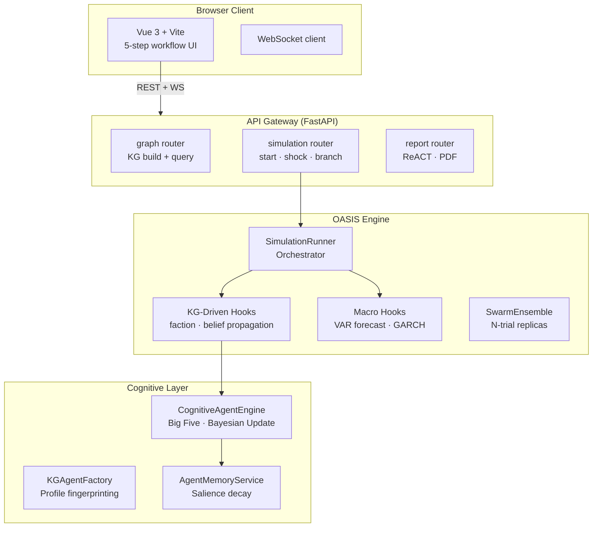

# 👁️ MurmuraScope
### Predict the Social Pulse | 預見社會脈動


---

## 🌟 Overview / 概覽

**[EN]** MurmuraScope is a high-fidelity social simulation engine that bridges the gap between raw text and probabilistic forecasting. Unlike static LLM analysis, MurmuraScope builds a dynamic environment where up to 50,000 digital agents interact, evolve, and react to real-world events in a multi-round, closed-loop simulation.

**[繁中]** MurmuraScope 是一個高真度的社會模擬引擎，旨在彌合原始文本與概率預測之間的鴻溝。與一般的靜態 AI 分析不同，MurmuraScope 會建立一個動態環境，讓多達 50,000 個數位代理進行互動、演化，並在多輪閉環模擬中對現實事件作出反應。

---

## 🚀 Engine Capabilities / 引擎核心能力

### 1. Automated Knowledge Graph Construction (自動化知識圖譜構建)
**[EN]** The engine parses seed text to extract entities, latent relationships, and hidden power structures. It populates the world with up to 50 implied actors not explicitly mentioned in the source, creating a complete social ecosystem.
**[繁中]** 引擎會解析種子文本，提取實體、潛在關係及隱藏的權力結構。系統會自動生成最多 50 個文本中未明確提及但具影響力的隱含角色，建立完整的社會生態。

### 2. Cognitive Agent Architecture (認知代理架構)
**[EN]** Every agent is equipped with a **Big Five** personality profile, a 3D emotional state, and a **Bayesian belief system**. Agents don't just "talk"; they update their worldviews based on evidence, trust, and social influence across rounds.
**[繁中]** 每個代理都配備了 **五大人格 (Big Five)** 特徵、三維情緒狀態及 **貝葉斯信念系統**。代理不只是「說話」，他們會根據每輪模擬中的證據、信任度和社會影響力來更新其世界觀。

### 3. Econometric & Statistical Forecasting (計量經濟與統計預測)
**[EN]** We go beyond qualitative guesses. MurmuraScope employs **VAR/VECM** models for trend forecasting, **GARCH(1,1)** for volatility clustering during crises, and **Monte Carlo Ensembles** (up to 500 trials) to generate reliable confidence intervals for social outcomes.
**[繁中]** 我們超越了定性的猜測。MurmuraScope 採用 **VAR/VECM** 模型進行趨勢預測，使用 **GARCH(1,1)** 捕捉危機期間的波動聚集，並通過 **蒙特卡羅集成模擬 (Monte Carlo Ensembles)** 運行多達 500 次試驗，為社會結果生成可靠的置信區間。

### 4. Emergence & Faction Metrics (湧現與派系指標)
**[EN]** The engine detects the emergence of "Echo Chambers" and polarization using **TDMI (Transfer Dependency Mutual Information)** and **Louvain community detection**. It identifies tipping points before they occur in the simulation.
**[繁中]** 引擎利用 **TDMI (轉移依賴互信息)** 和 **Louvain 社群檢測** 來識別「同溫層」的出現與兩極化趨勢。它能在模擬過程中預測即將發生的轉折點 (Tipping Points)。

---

## 🎯 Strategic Use Cases / 策略應用場景

| Scenario / 場景 | Engine Utility / 引擎作用 |
| :--- | :--- |
| **Information Operations** <br> 資訊戰與輿論引導 | Simulate how a specific narrative propagates through different social network topologies and identify key nodes of resistance. <br> 模擬特定論述在不同社交網絡拓撲中的傳播方式，並識別關鍵的抵抗節點。 |
| **Policy Shock Testing** <br> 政策衝擊測試 | Inject sudden policy changes or "Shocks" to observe the cascading effects on public trust and social stability. <br> 注入突發的政策變動或「衝擊」，觀察其對公眾信任和社會穩定的連鎖反應。 |
| **Geopolitical Strategy** <br> 地緣政治博弈 | Run multi-round diplomatic or conflict simulations where stakeholders delivate based on strategic fingerprints and historical memory. <br> 運行多輪外交或衝突模擬，決策者將根據戰略特徵和歷史記憶進行深度推演。 |

---

## 🛠 Quickstart / 快速入門

```bash
# 1. Setup Environment
cp .env.example .env        # Add API keys

# 2. Launch with Docker
docker compose up -d        # Frontend :8080 | Backend :5001
```

---

## 🔬 Technical Deep Dive / 技術深挖

<details>
<summary><b>📊 System Architecture (系統架構圖)</b></summary>


</details>

<details>
<summary><b>📈 Detailed Tech Specs (詳細技術規格)</b></summary>

- **Cognition:** Bayesian Belief Revision based on source credibility.
- **Sim Dynamics:** Parallel memory processing + sequential deliberation.
- **Forecasting:** Walk-forward backtesting with CRPS and Brier skill scores.
- **Analytics:** DuckDB analytical overlay for sub-second query performance on simulation logs.
- **Storage:** SQLite WAL for persistence + LanceDB for vector-based memory retrieval.
</details>

---

## 📜 License / 許可證

Proprietary. All rights reserved. / 私有軟體，保留所有權利。
