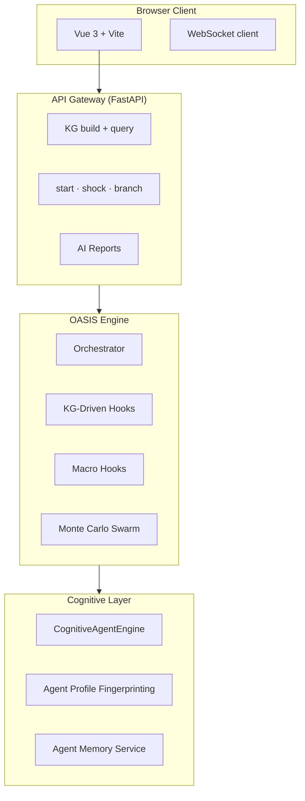

# 👁️ MurmuraScope
### Predict the Social Pulse | 預見社會脈動


---

## 🌟 Overview / 概覽

**[EN]** MurmuraScope is a powerful social simulation engine. It turns news, articles, or reports into a dynamic digital world where thousands of "AI agents" interact and react to events, giving you a data-driven forecast of how society might respond to real-world changes.

**[繁中]** MurmuraScope 是一個強大的社會模擬引擎。它能將新聞、文章或報告轉化為一個動態的數位世界，讓數千個「AI 代理」進行互動並對事件作出反應，為您提供基於數據的社會發展預測。

---

## 🚀 3-Minute Easy Start (For Non-Technical Users) 
### ⚡ 零技術背景 3 分鐘快速啟動指南

如果你唔識寫 Code (No IT Skills)，跟住呢 3 步就可以喺你電腦行到 MurmuraScope：

1.  **Download Docker (下載安裝程式):** 
    去 [Docker Desktop](https://www.docker.com/products/docker-desktop/) 下載並安裝佢。就好似裝 WhatsApp 咁簡單，裝完開咗佢就得。
2.  **Get Your API Keys (獲取鑰匙):** 
    去 [OpenRouter](https://openrouter.ai/) 註冊並拎一個 API Key (用嚟俾 AI 代理「諗嘢」)。
3.  **One-Click Start (一鍵啟動):** 
    下載呢個項目嘅資料夾，打開入面嘅 `.env.example` 檔案，將佢改名做 `.env`，並將你嘅 API Key 填入去。最後，喺終端機 (Terminal) 輸入以下指令：
    ```bash
    docker-compose up -d
    ```
    完成！打開瀏覽器輸入 `http://localhost:8080` 就可以見到介面。

---

## 🧠 Engine Capabilities / 引擎核心能力

*   **🤖 Cognitive Agents:** Every agent has a "personality" (Big Five) and beliefs. They change their minds based on evidence and social pressure.
*   **📈 Statistical Forecasting:** Uses advanced math (Monte Carlo & Econometrics) to give you reliable probabilities, not just guesses.
*   **🌐 Knowledge Graph:** Automatically identifies key players and hidden relationships from any text you paste.
*   **⚡ Policy Shocks:** Test "What if?" scenarios by injecting sudden events to see how the simulation evolves.

---

## 🎯 Strategic Use Cases / 策略應用場景

| Scenario / 場景 | Engine Utility / 引擎作用 |
| :--- | :--- |
| **Breaking News Reaction** <br> 突發新聞反應 | Predict how different social groups will react to a new policy or event. <br> 預測不同社會群體對新政策或事件的反應。 |
| **Geopolitical Analysis** <br> 地緣政治分析 | Simulate potential escalations or diplomatic shifts based on strategic briefs. <br> 根據戰略簡報，模擬潛在的局勢升級或外交轉向。 |
| **Crisis Management** <br> 危機管理 | Test which interventions effectively calm social unrest before implementing them. <br> 在實施干預措施前，測試哪種方案能有效平息社會動盪。 |

---

## 🔬 Technical Deep Dive / 技術細節 (For Developers)

<details>
<summary><b>📊 System Architecture (系統架構圖)</b></summary>


</details>

<details>
<summary><b>🛠 Tech Specs (技術規格)</b></summary>

- **AI Logic:** Bayesian Belief Revision & Big Five personality mapping.
- **Forecasting:** VAR/VECM, GARCH(1,1) for volatility, Monte Carlo ensembles.
- **Stack:** Python 3.11, FastAPI, Vue 3, DuckDB, LanceDB, SQLite WAL.
- **Testing:** 2700+ unit tests, 134 integration tests.
</details>

---

## 📜 License / 許可證

**Prosperity Public License 2.0.0**
- **Non-commercial:** Free for personal or non-profit research use.
- **Commercial:** Requires a separate license for business or profit-making use.

Copyright (c) 2026 destinyfrancis. All rights reserved.
